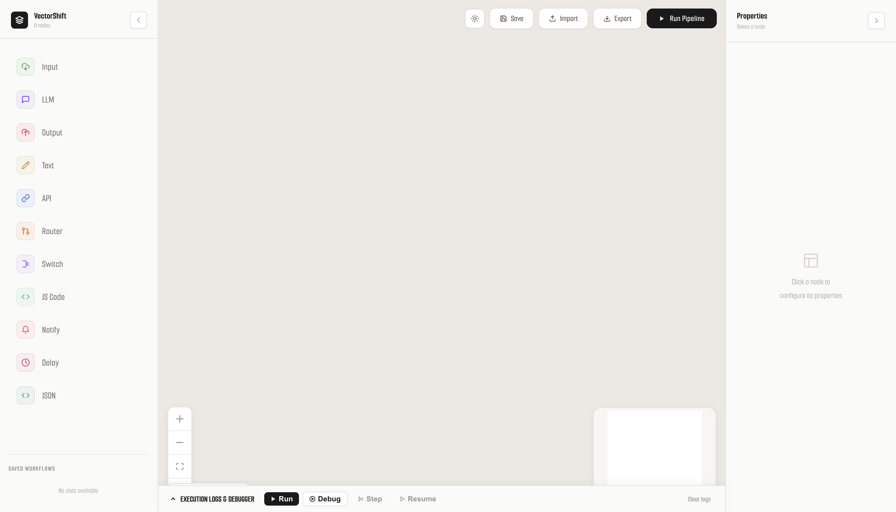
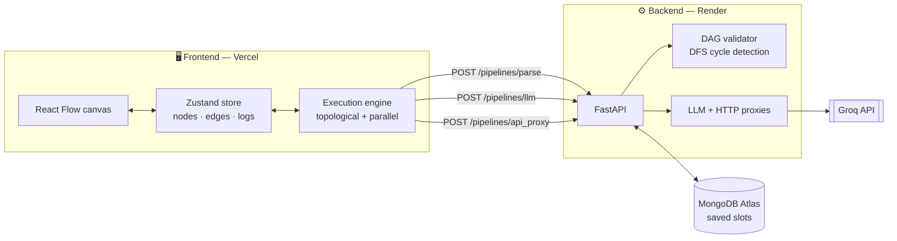

<div align="center">

# ⚡ VectorShift

**A visual, node-based workflow builder for composing LLM pipelines, API calls, and branching automation — with a real step-through debugger.**

Drag nodes onto a canvas, wire them together, hit run, and watch execution flow through the graph node by node.

[](https://react.dev)
[](https://reactflow.dev)
[](https://zustand-demo.pmnd.rs)
[](https://fastapi.tiangolo.com)
[](https://python.org)
[](https://mongodb.com/atlas)
[](https://vercel.com)
[](https://render.com)



</div>

---

## What it does

VectorShift turns a directed graph into an executable program. Each node is a small unit of work —
call a model, hit an endpoint, branch on a condition, run a snippet of JavaScript — and edges carry
values between them. The whole graph is validated as a DAG before anything runs.

| | |
|---|---|
| 🎯 **11 node types** | LLM, API, Router, Switch, JS Code, Text templating, JSON, Delay, Notify, Input, Output |
| 🐛 **Step-through debugger** | Pause before every node, inspect resolved inputs and outputs, then Step or Resume |
| ⚡ **Parallel execution** | Independent branches run concurrently; dependents wait on their inputs |
| 🔀 **Branch skipping** | Nodes downstream of an untaken branch are marked `skipped`, not failed |
| 🧬 **Dynamic ports** | Type `{{name}}` in a Text node and an input port appears for it |
| 🔁 **DAG validation** | Server-side cycle detection rejects loops before execution |
| 💾 **Save / load slots** | Persist pipelines to MongoDB, with automatic in-memory fallback |
| 📦 **Import / export** | Round-trip an entire pipeline as JSON |
| 🌗 **Light & dark themes** | Warm light default, animated toggle |

---

## Node reference

| Node | Inputs | Outputs | What it does |
|---|---|---|---|
| **Input** | — | `value` | Entry point. Supplies a literal value to the pipeline. |
| **Output** | `value` | — | Exit point. Collected and shown in the run summary. |
| **LLM** | `System`, `Prompt` | `Response` | Proxies to Groq (`llama-3.3-70b-versatile`) through the backend. |
| **Text** | *dynamic* | `output` | Template string. Every `{{name}}` spawns a matching input port. |
| **API** | `Payload` | `Response`, `Status` | HTTP request executed server-side, so CORS never blocks it. |
| **Router** | `Input` | `True`, `False` | Two-way branch across 9 conditions (equals, contains, regex, numeric comparison, …). |
| **Switch** | `Input` | `Case 1..N`, `Default` | N-way branch on exact match. |
| **JS Code** | *dynamic* | `Result` | Runs a JavaScript snippet. Input ports are configurable and arrive as an `inputs` object. |
| **JSON** | `Raw` | `Parsed`, `Error` | Parses and optionally pretty-prints. Parse failures route to `Error`. |
| **Delay** | `In` | `Out` | Passes its value through after a configurable pause. |
| **Notify** | `Input` | — | Fires a browser alert or posts to a Slack webhook. |

Only the branch that matches produces a value. Everything downstream of the branch that *didn't*
match is marked `skipped` and left unexecuted — so a Router genuinely routes, rather than running
both sides.

---

## Architecture



**The pipeline actually executes in the browser.** The backend validates the graph, proxies calls
that a browser can't safely make itself (API keys, CORS), and persists saved workflows. That keeps
per-node status updates instant, with no polling.

---

## Quick start

**Prerequisites** — Node.js 18+, Python 3.10+, and optionally MongoDB. Without Mongo the backend
transparently falls back to an in-memory store.

### Backend

```bash
cd backend
python3 -m venv .venv && source .venv/bin/activate
pip install -r requirements.txt

cp ../.env.example ../.env        # optional — see table below
uvicorn main:app --reload
```

→ http://localhost:8000 · health check at [`/health`](http://localhost:8000/health)

### Frontend

```bash
cd frontend
npm install
npm run dev
```

→ http://localhost:3000 (defaults to the backend above; override with `REACT_APP_API_URL`)

### Environment

| Variable | Where | Required | Notes |
|---|---|---|---|
| `MONGO_DB` | backend | no | Atlas connection string. Omit → in-memory store, wiped on restart. |
| `GROQ_API_KEY` | backend | no | Only the LLM node needs it. Everything else works without. |
| `ALLOWED_ORIGINS` | backend | prod | Comma-separated origins. Defaults to `*`. |
| `ENVIRONMENT` | backend | no | `production` disables auto-reload. |
| `REACT_APP_API_URL` | frontend | prod | Backend base URL, no trailing slash. **Inlined at build time.** |

> `.env` is gitignored. Use `.env.example` as the template and never commit real credentials.

---

## API

| Method | Endpoint | Purpose |
|---|---|---|
| `GET` | `/health` | Liveness probe. Reports whether Mongo or the in-memory store is active. |
| `POST` | `/pipelines/parse` | Validates the graph, returns node/edge counts and `is_dag`. |
| `POST` | `/pipelines/llm` | Groq chat-completion proxy. |
| `POST` | `/pipelines/api_proxy` | Server-side HTTP request on behalf of an API node. |
| `POST` | `/pipelines/save/{slot}` | Save a pipeline to a named slot. |
| `GET` | `/pipelines/load/{slot}` | Load a saved pipeline. |
| `GET` | `/pipelines/list` | List slots with metadata. |
| `DELETE` | `/pipelines/clear/{slot}` | Empty a slot. |
| `POST` | `/pipelines/history/save` | Record an execution. |
| `GET` | `/pipelines/history/list` | 50 most recent executions. |
| `POST` | `/pipelines/parse-form` | Same as `/parse`, accepting form-encoded input. |

Interactive docs are served at `/docs` once the backend is running.

---

## Project structure

```
├── render.yaml                  # Render Blueprint (backend)
├── .env.example                 # Backend env template
├── .github/workflows/
│   └── keep-alive.yml           # Pings /health to defeat free-tier sleep
├── backend/
│   ├── main.py                  # FastAPI app, DAG validator, proxies
│   └── requirements.txt
└── frontend/
    ├── vercel.json              # Build config + SPA rewrite
    ├── .env.example
    └── src/
        ├── App.js               # Layout, properties panel, save/load
        ├── ui.js                # React Flow canvas
        ├── store.js             # Zustand store
        ├── executor.js          # Execution engine (normal + debug)
        ├── config.js            # API base URL
        ├── components/
        │   └── debuggerPanel.js # Logs, Run/Debug/Step/Resume
        └── nodes/               # baseNode.js + 11 node types
```

`baseNode.js` is the shared wrapper every node builds on — it owns the header, status ring, port
layout, and theming, so a new node type is usually just a props declaration.

---

## Deployment

Frontend on **Vercel**, backend on **Render**. Deploy the backend first — the frontend bakes its
URL in at build time.

<details>
<summary><b>1 · Backend → Render</b></summary>

<br>

**Blueprint (recommended).** Dashboard → **New → Blueprint** → select this repo. Render reads
[`render.yaml`](./render.yaml) and provisions everything, prompting for secrets.

**Manual.** **New → Web Service**, then:

| Setting | Value |
|---|---|
| Root Directory | `backend` |
| Build Command | `pip install --upgrade pip && pip install -r requirements.txt` |
| Start Command | `uvicorn main:app --host 0.0.0.0 --port $PORT` |
| Health Check Path | `/health` |

Two settings people get wrong: leaving **Root Directory** blank fails the build with
`requirements.txt not found`, and hardcoding `--port 8000` instead of `$PORT` makes the health check
time out, after which Render kills the deploy as unhealthy.

Set `ALLOWED_ORIGINS`, `MONGO_DB`, and `GROQ_API_KEY` under Environment. Never set `PORT` — Render
injects it. Verify with:

```bash
curl https://<service>.onrender.com/health
# {"status":"ok","database":"mongodb"}     ✅ Atlas connected
# {"status":"ok","database":"in-memory"}   ⚠️ no/unreachable MONGO_DB
```

</details>

<details>
<summary><b>2 · Frontend → Vercel</b></summary>

<br>

**New Project → Import**, set **Root Directory** to `frontend`.
[`frontend/vercel.json`](./frontend/vercel.json) supplies build settings and the SPA rewrite.

Add `REACT_APP_API_URL` = your Render URL (no trailing slash), then deploy.

> **CRA inlines `REACT_APP_*` at build time.** Changing that variable requires a **redeploy** —
> editing it alone will not change the shipped bundle.

> **Why the build command is `CI=false npm run build`:** Vercel sets `CI=true`, and Create React App
> treats *any* ESLint warning as fatal when it is. Warnings still appear in the log, they just no
> longer break the build.

</details>

<details>
<summary><b>3 · Close the CORS loop</b></summary>

<br>

Once Vercel gives you a production URL, set `ALLOWED_ORIGINS` to it on Render and redeploy the
backend. Until you do, the browser blocks every API call with a CORS error while the network tab
shows the requests going out — which reads like a frontend bug but isn't.

</details>

<details>
<summary><b>4 · Keeping the backend warm</b></summary>

<br>

Render sleeps free services after ~15 minutes idle, and the next request pays a 30–50 s cold start.
[`.github/workflows/keep-alive.yml`](.github/workflows/keep-alive.yml) pings `/health` every 14
minutes. Enable it by adding a repository **variable** (Settings → Secrets and variables → Actions →
Variables):

| Name | Value |
|---|---|
| `BACKEND_URL` | `https://<service>.onrender.com` |

Without it the job exits cleanly instead of failing, so you won't get an email every 14 minutes.

Two honest limits: GitHub's scheduled runs are best-effort and drift by minutes under load,
sometimes past the 15-minute threshold — an external monitor (UptimeRobot, cron-job.org) is the only
hard guarantee. And Render's free tier allows 750 instance-hours per month, while keeping one
service awake around the clock costs ~730, so a single always-on service consumes nearly the whole
allowance.

</details>

---

## Troubleshooting

<details>
<summary><b>MongoDB: <code>TLSV1_ALERT_INTERNAL_ERROR</code> / SSL handshake failed</b></summary>

<br>

Almost always **your IP is not on the Atlas access list**, not a TLS bug. Atlas shared tiers sit
behind a multi-tenant proxy that routes on SNI and rejects unrecognised sources during the
handshake, before authentication — so an access-control refusal surfaces as a TLS error.

Fix: **Atlas → Network Access → Add IP Address**. Render's free tier has no static outbound IPs, so
in practice this means `0.0.0.0/0`, which makes your database password the only barrier. Use a
strong password and a least-privilege user (`readWrite` on `pipeline_db`, not `atlasAdmin`).

A genuine TLS problem would fail from *every* machine. If it works locally and fails when deployed,
it's the allowlist.

</details>

<details>
<summary><b>Frontend loads but every API call fails</b></summary>

<br>

In order of likelihood: `ALLOWED_ORIGINS` on Render doesn't include your Vercel URL; or
`REACT_APP_API_URL` was set but the frontend wasn't redeployed afterwards; or the backend is cold
and the first request is still waking it (wait ~50 s and retry).

</details>

<details>
<summary><b>Saved workflows keep disappearing</b></summary>

<br>

The backend is running on its in-memory fallback — check `/health`. That store is wiped on every
restart, and free-tier instances restart constantly. Point `MONGO_DB` at an Atlas M0.

</details>

---

## Contributing

1. **Fork** the repo and clone your fork.
2. Branch: `git checkout -b fix/short-description`.
3. Follow the Quick Start and confirm both servers run.
4. Keep commits focused — one logical change each, explaining *why*, not just *what*.
5. Before opening a PR:
   ```bash
   cd frontend && npm run build
   cd ../backend && python -m py_compile main.py
   ```
6. Open a PR against `main` describing what changed, how you reproduced the original behaviour, and
   how you verified the fix.

**Never commit secrets.** `.env` is gitignored — keep real keys out of the repo *and* out of your
commit history.

---

<div align="center">
<sub>Built with React Flow, Zustand, and FastAPI.</sub>
</div>
